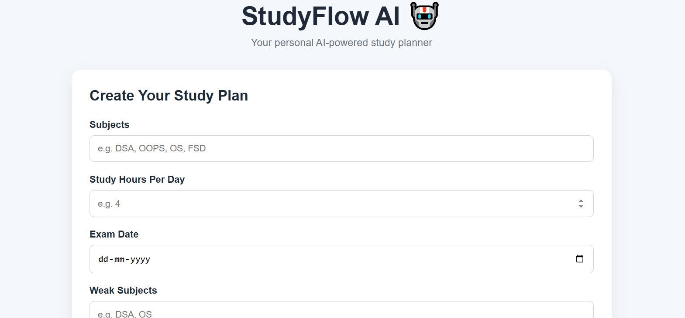

# 📚 StudyFlow AI


An AI-powered study planner that creates personalized study schedules based on a student's subjects, available study time, exam date, and weak subjects.

## 🚀 Features

- 📝 Enter multiple subjects
- ⏱️ Set daily study hours
- 📅 Add exam date
- 🎯 Identify weak subjects
- 🤖 Generate personalized study plans using Google Gemini AI
- ✅ Track completed study tasks
- 📊 View study progress
- 🔐 Keep API keys protected using environment variables

## 🛠️ Tech Stack

### Frontend
- HTML
- CSS
- JavaScript

### Backend
- Node.js
- Express.js

### AI
- Google Gemini API

### Tools
- Git
- GitHub
- VS Code

## 🏗️ Project Structure

```text
StudyFlow-AI/
│
├── index.html
├── style.css
├── script.js
├── README.md
├── .gitignore
├── package.json
├── package-lock.json
│
└── server/
    └── server.js